# FY2022 Project PLATEAU UC22-018「地域防災支援プラグイン」の成果物(disaster-prevention-support)<!-- omit in toc -->

## 1. 概要<!-- omit in toc -->
令和4年度の3D都市モデルを活用した公共ユースケース開発業務「地域防災支援プラグイン」において使用したデータおよび開発したRe:Earthプラグインです。  
地域における様々な防災情報をウェブ上で 3D 都市モデルとともに分かりやすく可視化するためのシステムです。

## 2. 「地域防災支援プラグイン」について<!-- omit in toc -->
### 2.1  ユースケースの概要<!-- omit in toc -->
地域の防災力を向上させるためには、住民主体による地区防災計画の立案などボトムアップ型の対策が重要となる。  
他方、これらの議論に必要な地域の災害リスク情報や関連施設に関する情報は分散しており、一般の住民にとってわかりやすい形で議論を進めることは難しかった。  
今回の実証実験では、3D 都市モデルを活用して地域の避難施設の想定収容人数等の防災上必要な各種施設の詳細情報をインフォボックスとして分かりやすく可視化するツールを開発し、住民によるワークショップでの活用を行う。  
これにより、住民の防災情報へのアクセシビリティを向上させ、住民主体の防災まちづくりを推進することを目指す。

### 2.2 開発システムの概要<!-- omit in toc -->
住民の防災情報へのアクセシビリティを向上させ、住民による避難計画等の策定を支援することを目的として、地域における様々な防災情報をウェブ上で 3D 都市モデルとともに分かりやすく可視化する機能を Re:Earth のプラグイン(地域防災支援プラグインおよびリンクボタンプラグイン)として開発した。  
具体的には、住民が防災情報を参照しながら自分の避難ルートを検討できるよう、GeoJSONで記述されたラインデータを読み込んで表示する機能を開発した。  
GeoJSONは国土地理院が提供する「地理院地図」の作図機能を使って作成した。また、csv で記述された避難施設の情報を Re:Earth 上のフラグと紐づけ、ビューワ上で範囲を選択することで、範囲に含まれる避難施設の想定収容人数等の情報を csv で出力する機能を開発した。  
この他、Re:Earth の既存機能である、位置に紐づけてフラグ、画像、テキスト等の様々な情報を作成・編集・可視化できるインフォボックス機能を用いて、災害時に資源となる施設・設備（指定避難所や AED 等）やリスクとなる設備（ブロック塀や電柱等）の施設写真や施設概要（災害時の役割等）、現地踏査により得られた詳細情報（ブロック塀の損傷状況等）等を追加した。

#### 地域防災支援プラグイン<!-- omit in toc -->
あらかじめ準備した防災施設などのランドマークや、その詳細情報のインフォボックス、避難ルートをRe：Earth上に表示します。  
また画面上に表示されている施設などのインフォボックスの情報をExcelファイルで出力します。

#### リンクボタンプラグイン<!-- omit in toc -->
ボタンをクリックすることで、あらかじめ指定したURLのサイトへアクセスすることができます。

- プラグインをインストールしたRe:Earthの画面イメージ
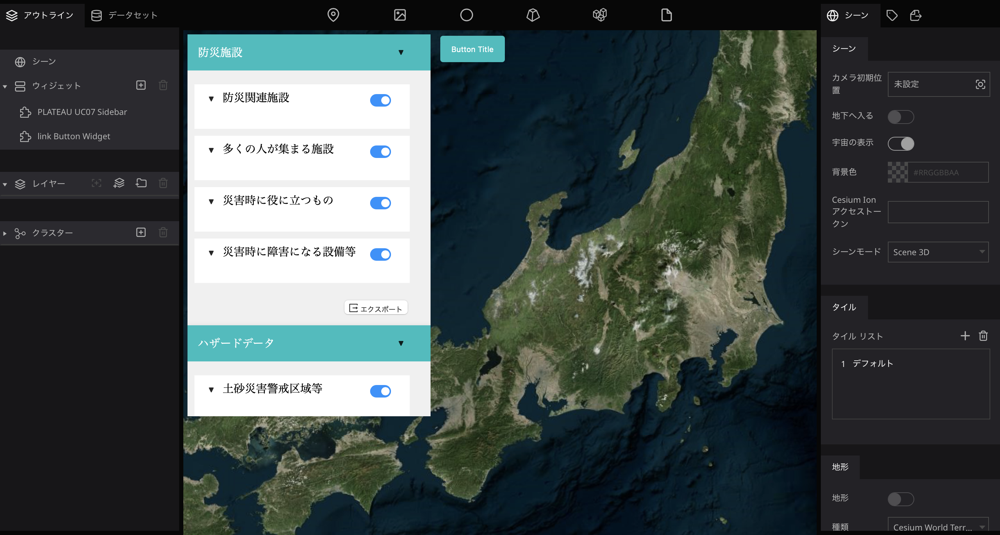

#### サンプルデータ<!-- omit in toc -->
- csv
  各防災関連施設の地点リストcsvファイルを格納しています。
   設定方法は、「[3.2.1 ランドマーク・インフォボックスの設定](#321-ランドマークインフォボックスの設定)」を参照してください。
   ファイル名とデータの内容の対応は以下の通りです。

| ファイル名                 | データ説明                   | 使用箇所                                                                                                                                                                 |
| -------------------------- | ---------------------------- | ------------------------------------------------------------------------------------------------------------------------------------------------------------------------ |
| 11_evacuation_center.csv   | 避難所の地点リスト           | ・「3.2データの設定 > ランドマーク・インフォボックスの設定」でマップに追加してください。 ・地域防災支援プラグインでは「防災関連施設」に登録してください。             |
| 21_commercial_facility.csv | 商業施設の地点リスト         | ・「3.2データの設定 > ランドマーク・インフォボックスの設定」でマップに追加してください。 ・地域防災支援プラグインでは「多くの人が集まる施設」に登録してください。     |
| 31_evacuation_route.csv    | 避難経路の地点リスト         | ・「3.2データの設定 > ランドマーク・インフォボックスの設定」でマップに追加してください。 ・地域防災支援プラグインでは「災害時に役に立つもの」に登録してください。     |
| 43_barrier.csv             | 避難経路のバリアの地点リスト | ・「3.2データの設定 > ランドマーク・インフォボックスの設定」でマップに追加してください。 ・地域防災支援プラグインでは「災害時に障害になる設備等」に登録してください。 |

- icons
  マーカーのアイコンや地域防災支援プラグインで設定するアイコン画像を格納しています。
   ランドマークフラグのアイコン画像として設定する方法は、「[3.2.1 ランドマーク・インフォボックスの設定](#321-ランドマークインフォボックスの設定)」を、地域防災支援プラグインでの設定方法は「[3.3.2 地域防災支援プラグインの表示項目の設定](#332-地域防災支援プラグインの表示項目の設定)」を参照してください。
   ファイル名とデータの内容の対応は以下の通りです。

| ファイル名                 | データ説明                     | 使用箇所                                                                                                         |
| -------------------------- | ------------------------------ | ---------------------------------------------------------------------------------------------------------------- |
| 11_evacuation_center.png   | 避難所のアイコン画像           | ・「3.2データの設定 > ランドマーク・インフォボックスの設定」で避難所のアイコンとして使用してください。           |
| 21_commercial_facility.png | 商業施設のアイコン画像         | ・「3.2データの設定 > ランドマーク・インフォボックスの設定」で商業施設のアイコンとして使用してください。         |
| 31_evacuation_route.png    | 避難経路のアイコン画像         | ・「3.2データの設定 > ランドマーク・インフォボックスの設定」で避難経路のアイコンとして使用してください。         |
| 43_barrier.png             | 避難経路のバリアのアイコン画像 | ・「3.2データの設定 > ランドマーク・インフォボックスの設定」で避難経路のバリアのアイコンとして使用してください。 |

- files
  Re:Earth上でファイルレイヤとして表示するデータを格納しています。
  設定方法は「[3.2.2 警戒区域の設定](#322-警戒区域の設定)」を参照してください。
   ファイル名とデータの内容の対応は以下の通りです。

| ファイル名               | データ説明                         | 使用箇所                                                                                                                                                 |
| ------------------------ | ---------------------------------- | -------------------------------------------------------------------------------------------------------------------------------------------------------- |
| land_slide.geojson       | 地すべり防止区域ポリゴンデータ     | ・「3.2データの設定 > 警戒区域・避難ルートの設定」でマップに追加してください。 ・地域防災支援プラグインでは「土砂災害警戒区域等」に登録してください。 |
| rapid_slope.geojson      | 急傾斜地崩壊危険区域ポリゴンデータ | ・「3.2データの設定 > 警戒区域・避難ルートの設定」でマップに追加してください。 ・地域防災支援プラグインでは「土砂災害警戒区域等」に登録してください。 |
| land_slide_alert.geojson | 土砂災害警戒区域_ポリゴンデータ    | ・「3.2データの設定 > 警戒区域・避難ルートの設定」でマップに追加してください。 ・地域防災支援プラグインでは「土砂災害警戒区域等」に登録してください。 |

## 3.利用手順<!-- omit in toc -->

### 目次<!-- omit in toc -->

- [3.1 環境の準備](#31-環境の準備)
  - [3.1.1 Re:Earthのプロジェクトの作成](#311-reearthのプロジェクトの作成)
  - [3.1.2 プラグインのインストール](#312-プラグインのインストール)
- [3.2 データの準備・設定](#32-データの準備設定)
  - [3.2.1 ランドマーク・インフォボックスの設定](#321-ランドマークインフォボックスの設定)
  - [3.2.2 警戒区域・避難ルートの設定](#322-警戒区域避難ルートの設定)
  - [3.2.3 3D都市モデルの設定](#323-3d都市モデルの設定)
- [3.3 地域防災支援プラグインの設定](#33-地域防災支援プラグインの設定)
  - [3.3.1 タグの設定](#331-タグの設定)
  - [3.3.2 地域防災支援プラグインの表示項目の設定](#332-地域防災支援プラグインの表示項目の設定)
- [3.4 リンクボタンプラグインの設定](#34-リンクボタンプラグインの設定)
- [3.5 プラグインの使い方](#35-プラグインの使い方)
  - [3.5.1 地域防災支援プラグイン](#351-地域防災支援プラグイン)
  - [3.5.2 リンクボタンプラグイン](#352-リンクボタンプラグイン)
- [3.6 プラグインのカスタマイズ](#36-プラグインのカスタマイズ)

### 3.1 環境の準備

プラグインを利用するために、以下を設定します。
- Re:Earthのプロジェクトの作成
- プラグインのインストール

#### 3.1.1 Re:Earthのプロジェクトの作成
（1） 「新規プロジェクト作成」ボタンをクリックします。

（2）「プロジェクト名」を入力し、「作成」ボタンをクリックします。

（3）プロジェクトのボードが作成されるので、編集するプロジェクトボードにマウスカーソルをあてます。
     ボタンが３つ表示されるので、一番左の「編集ボタン」をクリックします。
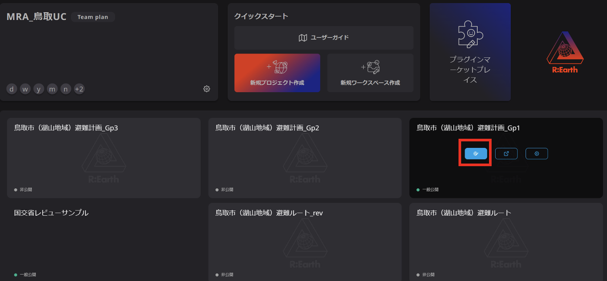

（4）マップの編集ページが表示されます。編集ページは主に４つの領域で構成されています。
   - ツールバー：レイヤーを追加する際に使用する。
   - マップ表示領域：地図が表示されます。
   - アウトライン：マップに追加しているレイヤーやプラグインによるウィジェットを管理します。
   - 設定項目：レイヤーやプラグインの各種設定を行います。

#### 3.1.2 プラグインのインストール
（1）Re:Earthのプロジェクト編集ページを開き、ページ上部のプロジェクト名をクリックし、「プラグイン」をクリックしてプラグインページを開きます。

（2）プラグインファイルのインストールをします。  
    ①「個人インストール済み」をクリックします。  
    ②「PCからZipファイルをアップロード」を選択し、[ダウンロードしたzipファイル](../../releases/tag/disaster-prevention-support)ダウンロードしたzipファイルをアップロードすることでプラグインをインストールが完了します。    
      プラグインがインストールされると、「インストール済み」にプラグインの名前が表示されます。  
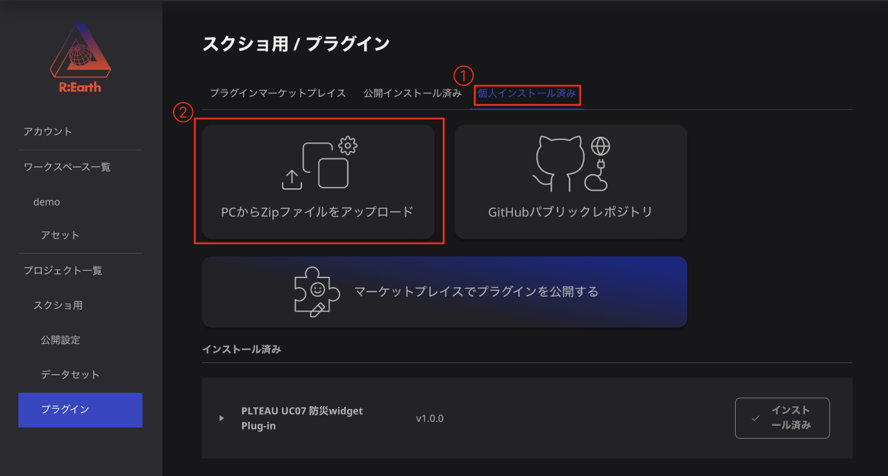

 （3） 編集画面に戻り、ページ左側に表示されているアウトラインの「ウィジェット」の＋ボタンをクリックし、「地域防災支援プラグイン」と「link Button Widget」をクリックして、ウィジェットにプラグインを追加します。
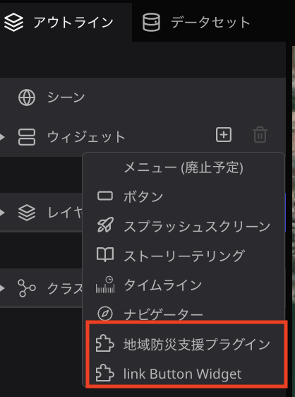

### 3.2 データの準備・設定

プラグインを利用するために必要な、以下のデータを準備・設定します。
- ランドマーク・インフォボックスの設定
- 警戒区域・避難ルートの設定
- 建物モデル（３DTiles）表示の設定

#### 3.2.1 ランドマーク・インフォボックスの設定

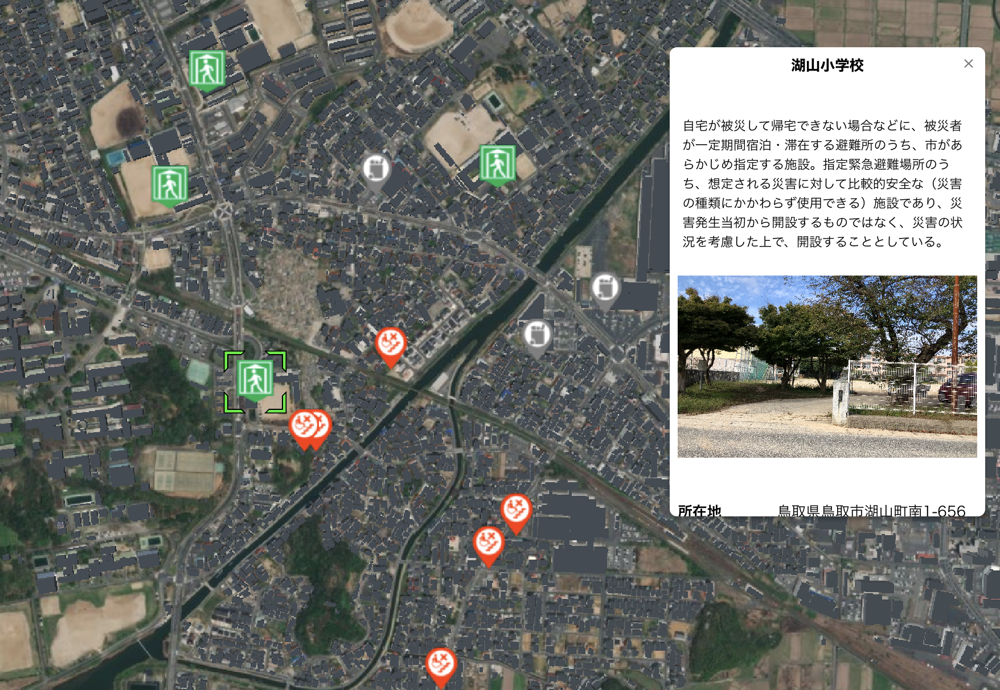
避難所の場所や災害時に避難の役に立つ情報などがある場所をランドマークフラグとしてマップ上にアイコンを表示させます。
また、マップ上に表示させたランドマークフラグをクリックすると、詳細な情報をインフォボックスとして表示できるように設定していきます。

##### ランドマーク情報の準備・設定<!-- omit in toc -->

ランドマーク情報を表示するためのCSVファイルを設定します。  

（1）csvファイルから、複数の地点情報を追加します。
追加するcsvファイルは、「lat」および「lng」の列を用意し、それぞれ「緯度」と「経度」の値を入力してください。
その他必要に応じて必要な情報を列を追加して入力してください。
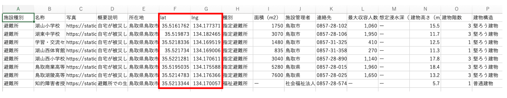

（2）  Re:Earthの編集ページ左側に表示されている「データセット」をクリックし、「データセットを追加」ボタンをクリックします。

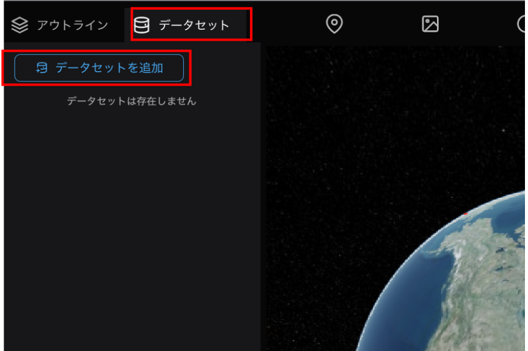

（3）アップロードをクリックし、各施設の地点リストのcsvファイルを選択し、「データセットを追加」をクリックします。
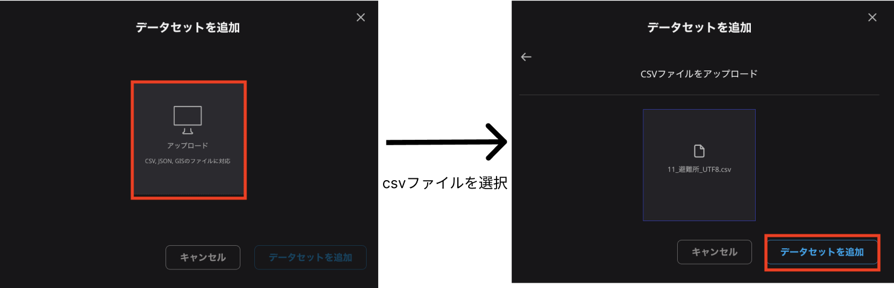

（4）レイヤータイプを設定します。  
  ①データセットが追加されると、画面左側に追加したデータセットの項目が表示されます。項目をクリックすると、画面右にメニューが表示されます。  
  ②レイヤータイプを「Marker」にし、「インポート」をクリックすると、マップにマーカーが表示されます。  
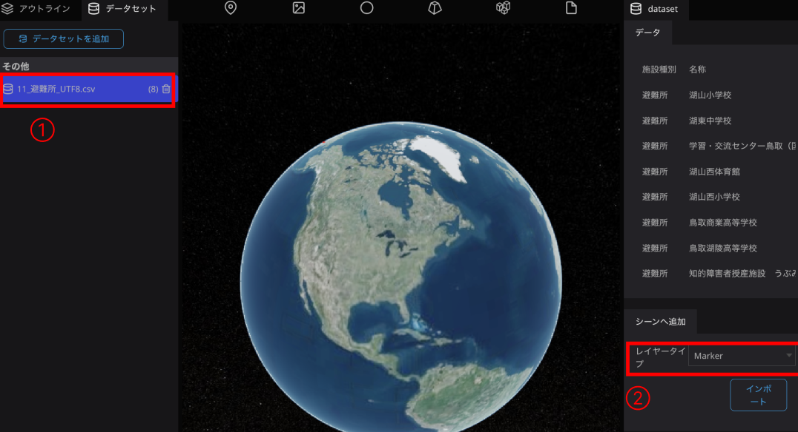

（5）画像を設定するため、テンプレートタブを表示します。   
  ①画面左のメニュからアウトラインタブをクリックし、レイヤーを展開するとデータセットレイヤが追加されています。レイヤ名はcsvファイルの名前と同じ名前です。  
  ②追加したデータセットレイヤをクリックすると、画面右側に設定項目が表示されます。表示方法が「アイコン」になっていることを確認し、画像URLの「未設定」となっている部分をクリックします。  
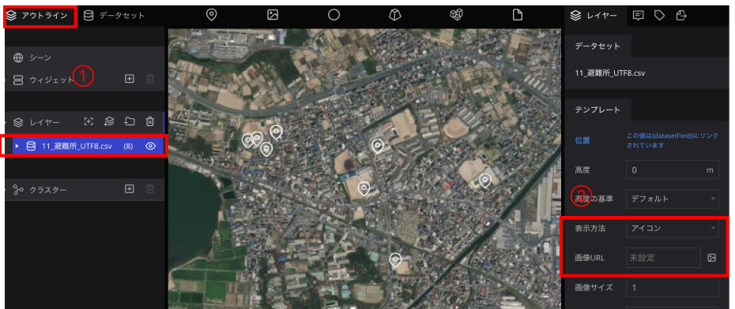

（6）アセットの選択ウィンドウが表示されます。アップロードをクリックすると、画像ファイルをアップロードすることができます。   
使用するアイコン画像をアップロードすると、アセット一覧に画像が表示されるので、画像をクリックし、「選択」ボタンをクリックします。

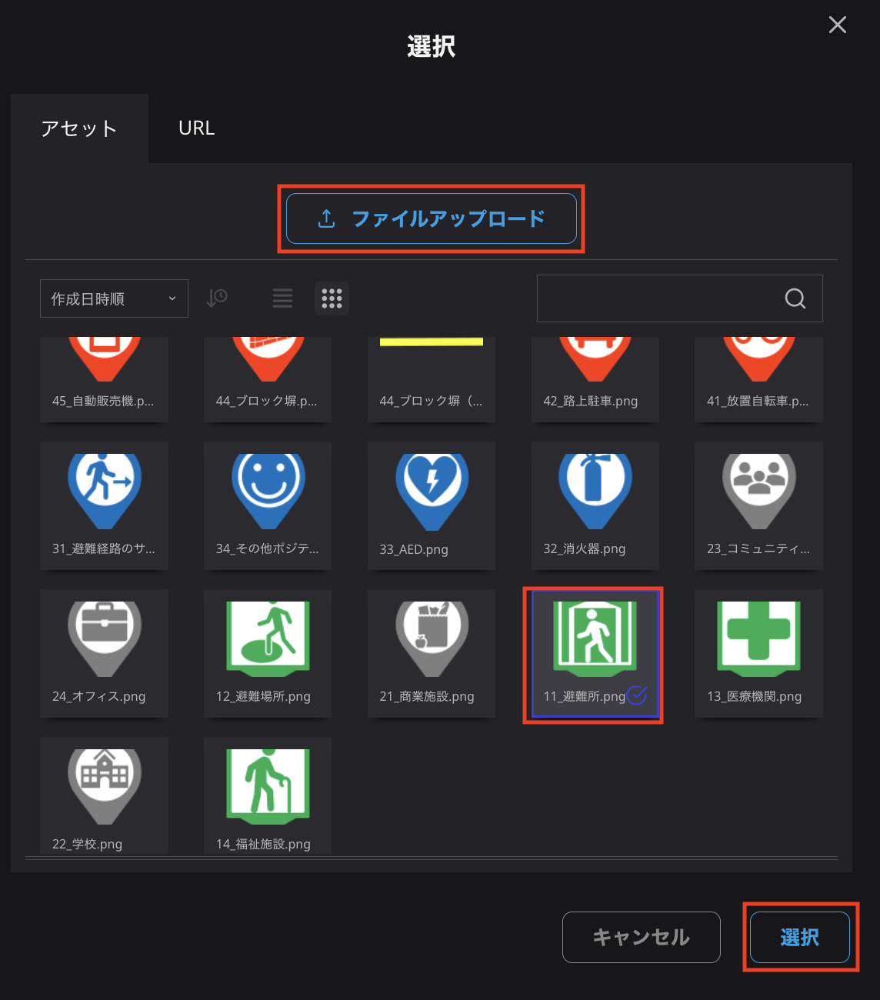

（7）マップ上に設定した画像でマーカーが表示されます。
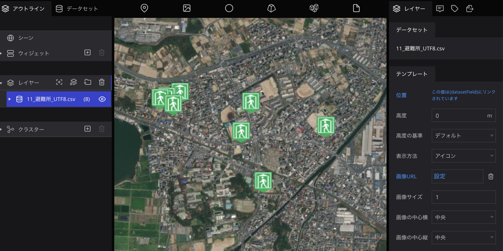

##### インフォボックスの追加<!-- omit in toc -->

- インフォボックスを設定します。地図上でマーカーをクリックすると、設定した情報がインフォボックスに表示されます。  
インフォボックスで表示された情報は「エクスポート」ボタンでエクセル形式で出力することが可能になります（詳細は『プラグインの使い方』に記載）。
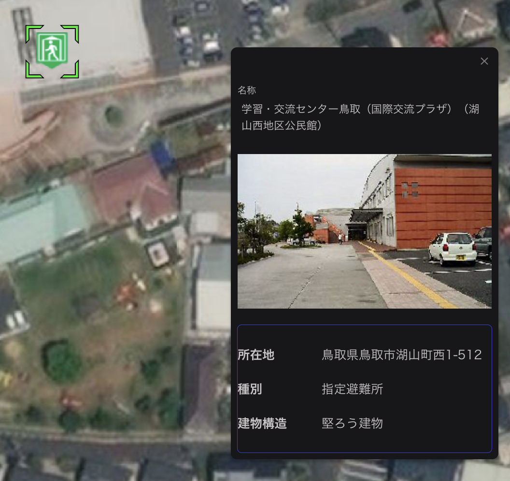

（1）インフォボックスを設定するレイヤーをクリックし、画面右側のインフォボックスタブをクリックします。さらに「インフォボックス作成」ボタンをクリックするとインフォボックスの設定画面が表示されます。  
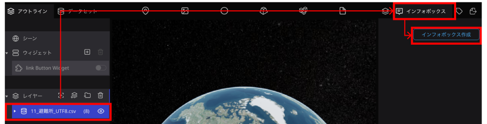

（2）インフォボックス設定画面内にマウスカーソルを動かすと「＋」のボタンが表示されるので、「＋」ボタンをクリックします。インフォボックスに表示させる形式をクリックすると、インフォボックス設定画面内にコンテンツ表示枠が追加されます。    
    文字情報を載せる場合は「Text」を、画像を載せる場合は「Image」を、表形式の情報を載せる場合は「Table」を選択してください。  
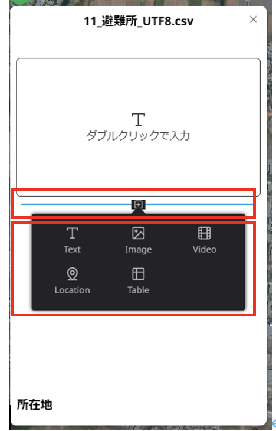

（3）「Text」を選択した場合は、以下の画面が表示されます。各形式に沿って、設定してください。  
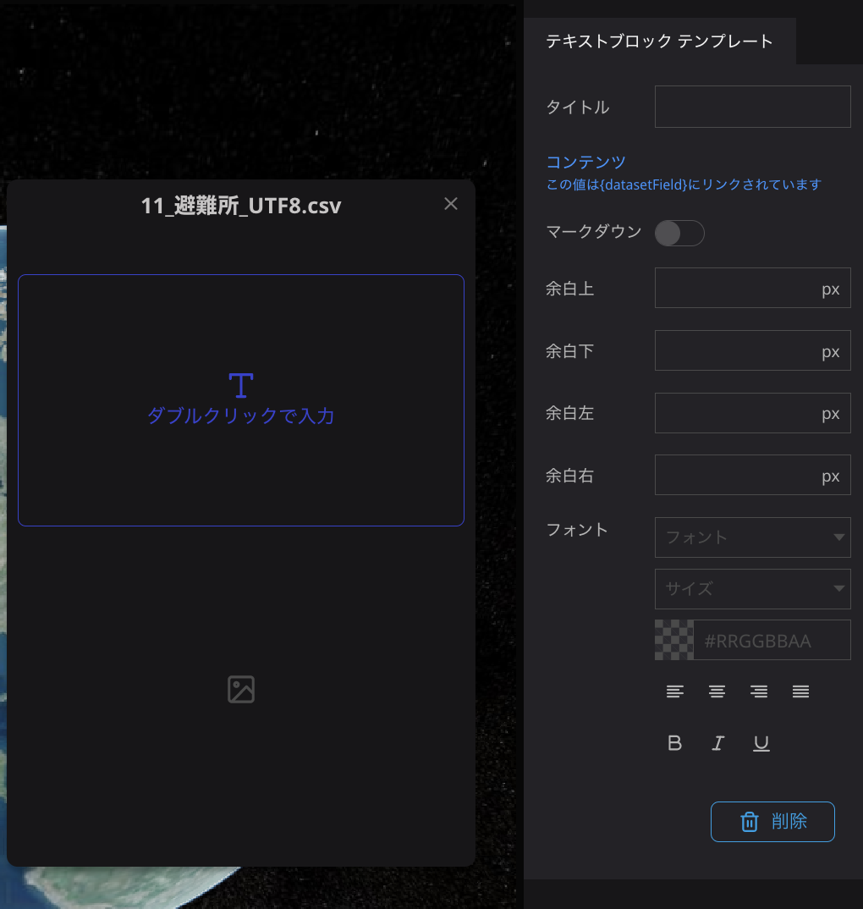

- テキストの設定  
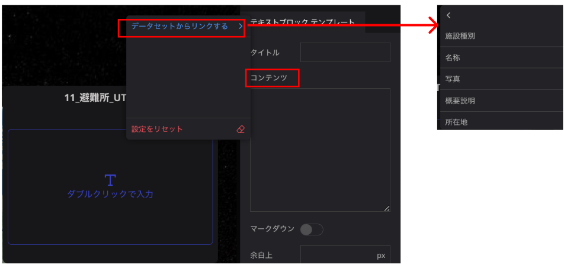 
  - 右メニューの「タイトル」には、「名称」や「所在地」など、どのような情報であるかを示すタイトルを入力してください。
  - 次に右メニューの「コンテンツ」をクリックし、「データセットからリンクする」をクリックすると、csvデータ内のカラム一覧が表示されます。テキストとして表示させたいカラム名をクリックしてください。  

- 画像の設定  
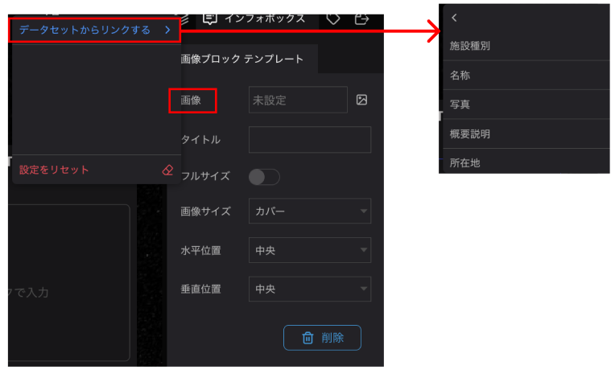
  - 右メニューの「画像」をクリックし、「データセットからリンクする」をクリックすると、csvデータ内のカラム一覧が表示されます。表示させたい画像のURLが記載されているカラム名をクリックしてください。

- 表の設定  
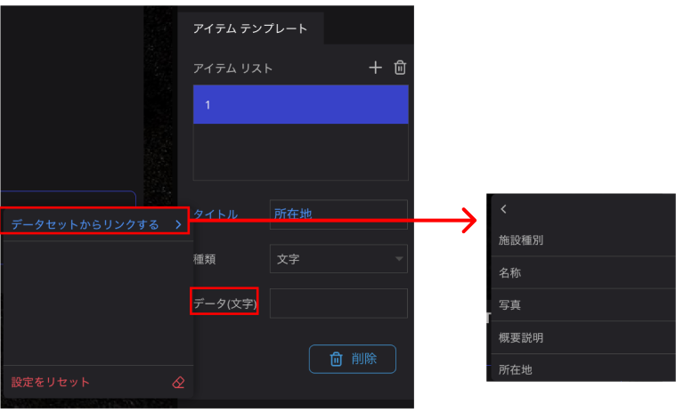
  - 右メニューのアイテムリストの「＋」をクリックし、テーブルのリストを追加します。
  - それぞれのリストのタイトルには、「名称」や「所在地」など、どのような情報であるかを示すタイトルを入力してください。
  - 表示する情報が数値情報なら種類を「数字」に、文字情報なら「文字」にしてください。
  - 次に「データ(文字)」をクリックし、「データセットからリンクする」をクリックすると、csvデータ内のカラム一覧が表示されます。テキストとして表示させたいカラム名をクリックしてください。

#### 3.2.2 警戒区域・避難ルートの設定
地域防災支援プラグインには、GeoJSONで作成した避難ルートを読み込むことができ、その避難ルートは地理院地図で作成することができます。

(避難ルートの作成は「[地理院地図での避難ルートの作成](#地理院地図での避難ルートの作成)を参照してください）

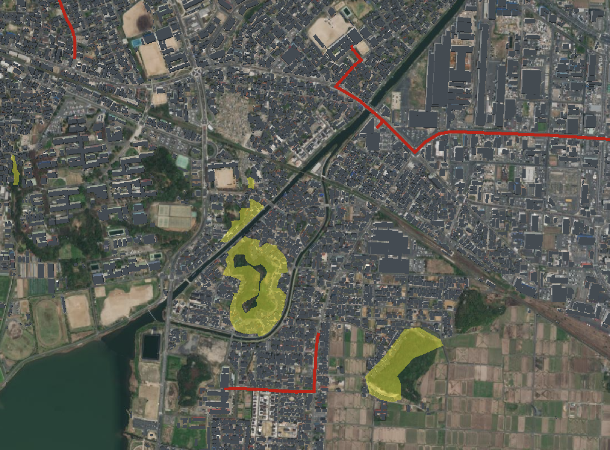
警戒区域のポリゴンおよび避難ルートのラインを表示する設定を行います。

警戒区域・避難ルートはGeoJSON形式のファイルとして追加していきます。

（1）設定画面を表示します。  
   ①ファイルレイヤーのアイコンを地図上にドラッグ＆ドロップします。  
   ②レイヤーにファイルレイヤーが追加されます。  
   ③画面右の設定項目の「ファイルURL」の項目をクリックします。  
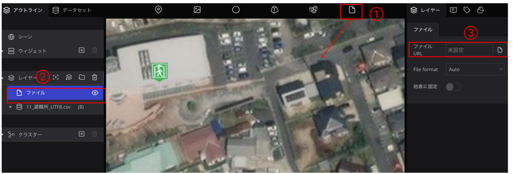

  
（2）ファイルを選択します。  
   ①「ファイルをアップロード」をクリックして、表示するGeoJSONファイルをアップロードします。アップロードすると、アセットのリストに追加されます。  
   ②アセットから表示するGeoJSONファイルをクリックしてください。  
   ③「選択」ボタンをクリックします。  
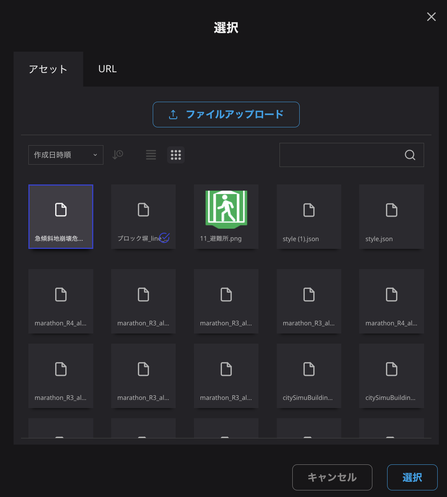

（3）地図上にGeoJSONファイルのデータが表示されます。  
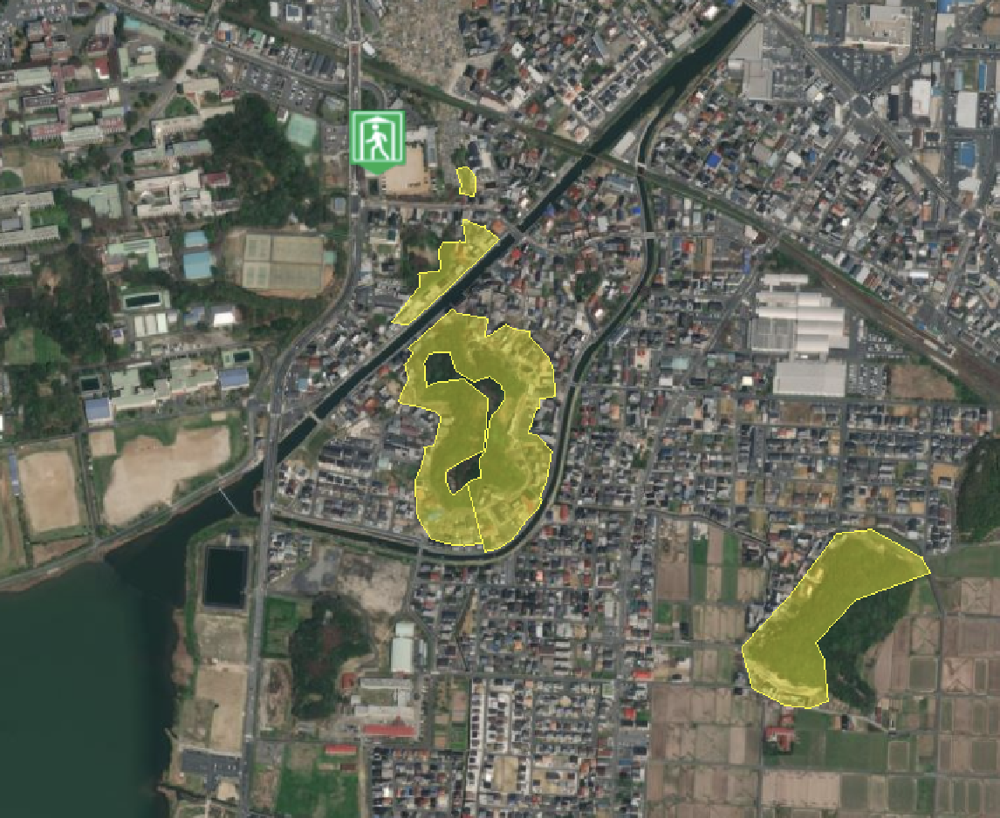

##### 地理院地図での避難ルートの作成<!-- omit in toc -->

避難ルートは地理院地図のサイト（[https://maps.gsi.go.jp/](https://maps.gsi.go.jp/)）から作成することができます。

1. 「ツール」をクリックし、「作図・ファイル」をクリックします。  
2. さらに「線を追加」をクリックします。  
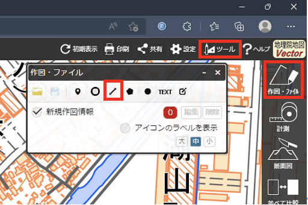

  
3. マップ状をクリックし、ルートを作図していきます。  
4. 作図終了にはダブルクリックします。  
5. 線の情報画面が表示されるので、そのまま「OK」をクリックします。  
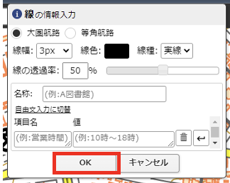

  
6. 「確定」をクリックします。  
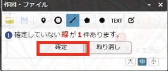

7. 「保存」をクリックします。    
8. GeoJSON形式にチェックを入れ、「上記の内容で保存」をクリックすると、作成したルートを保存することができます。  
9. 保存したルートをRe:Earthに読み込むには、[3.2.2 警戒区域の設定](#322-警戒区域の設定)を参照ください。  
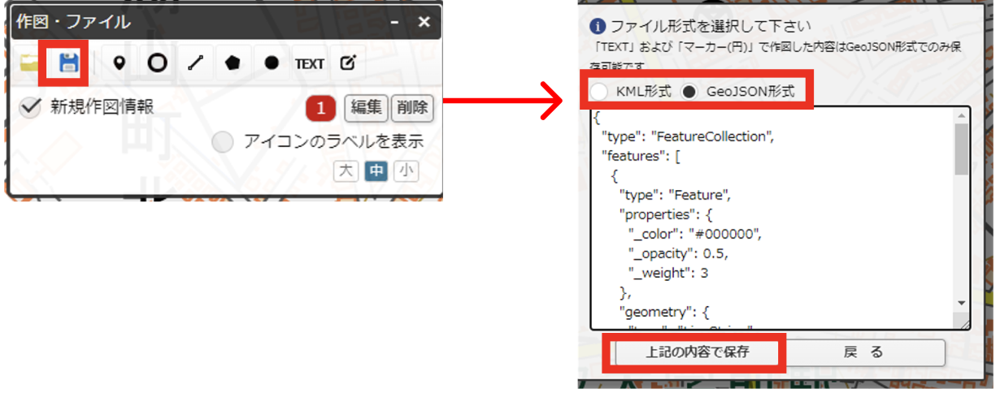

#### 3.2.3 3D都市モデルの設定
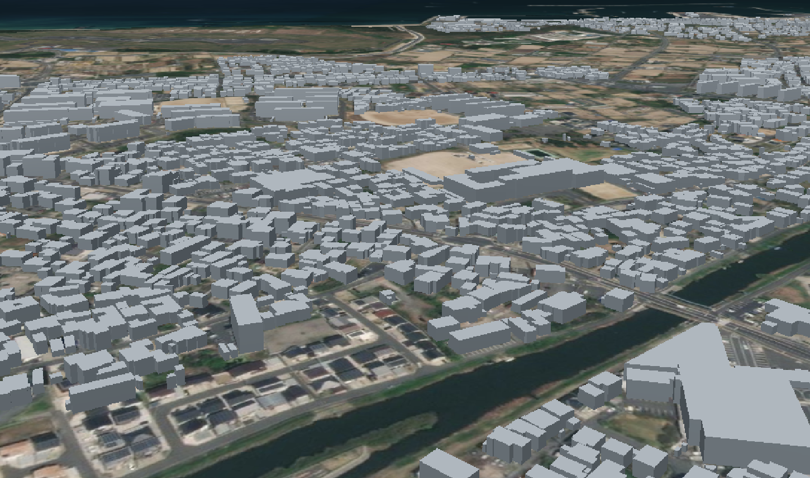
3D都市モデル表示するため、３DタイルのURLの設定を行います。  

（1）設定画面を表示します。  
  ①3Dタイルレイヤーのアイコンを地図上にドラッグ＆ドロップします。  
  ②レイヤーに3Dタイルレイヤーが追加されます。  
  ③画面右の設定項目の「タイルセットURL」の項目をクリックします。  
  
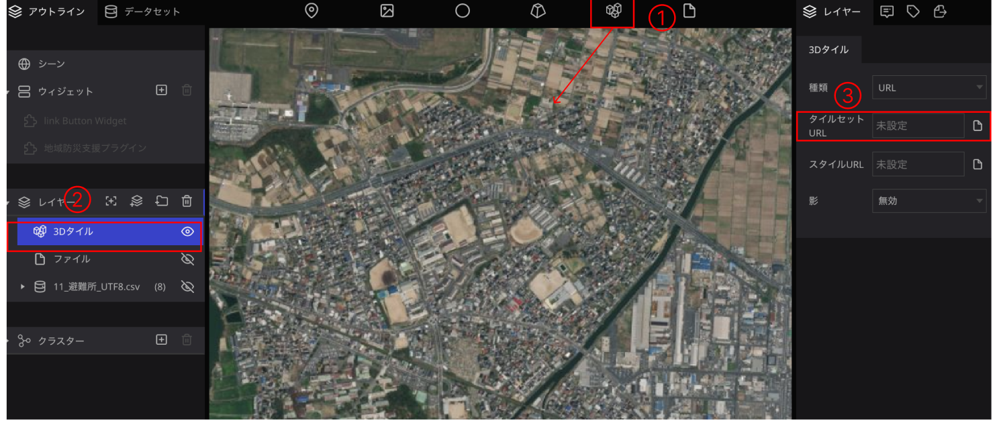

（2）URLを設定します。  
  ①「URL」タブをクリックします。  
  ② リソースURLに追加する３DタイルのURLを入力し、選択をクリックします。  
  　本ユースケースではPLATEAU配信サービスより配信されている３Dタイルを使用しています。
   
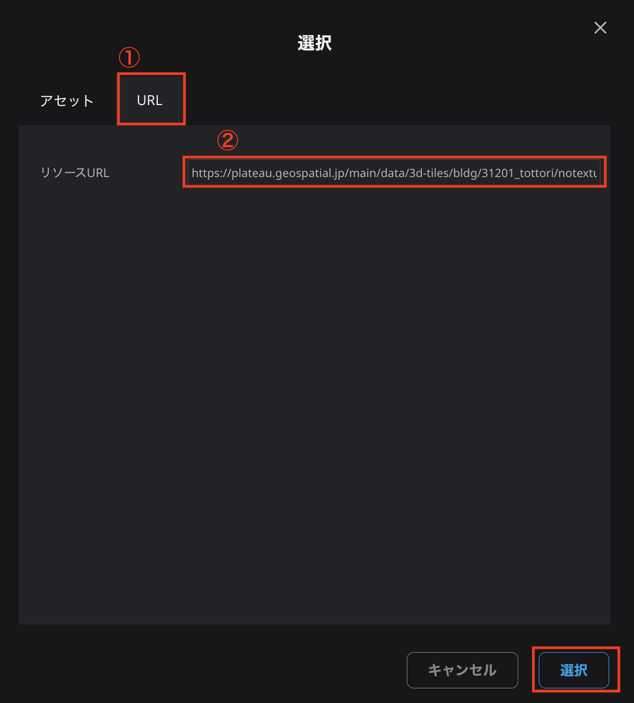

（3）３D都市モデルが表示されます。

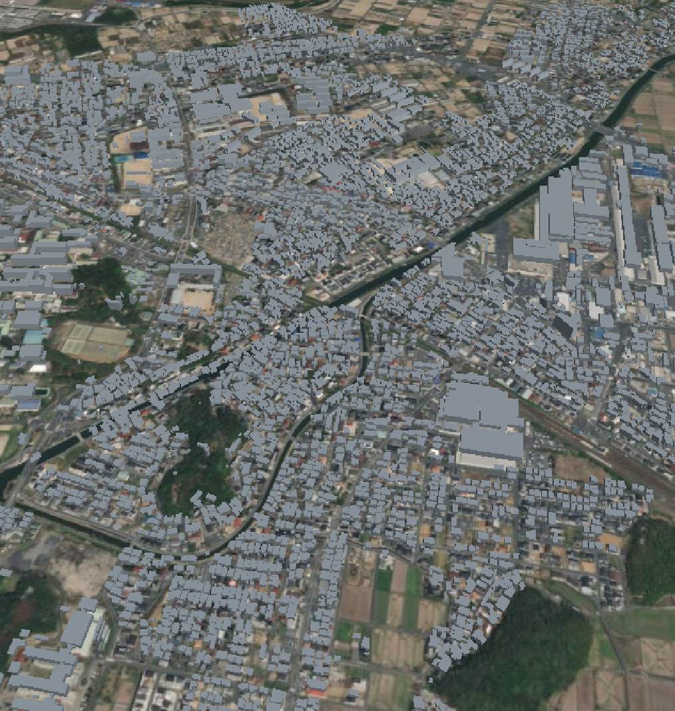

### 3.3 地域防災支援プラグインの設定

地域防災支援プラグインの各項目をオン/オフすることで、該当のレイヤの表示/非表示が切り替えることができるように、以下を設定します。
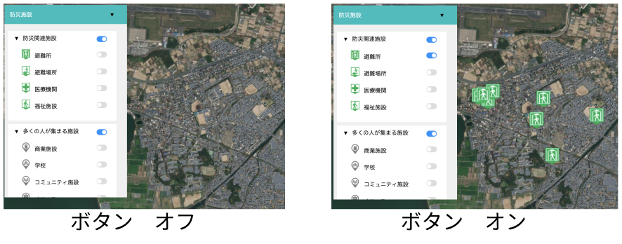

- タグの設定
- 地域防災支援プラグインの表示項目の設定 

#### 3.3.1 タグの設定
  
  （1）地域防災支援プラグインの表示項目を設定するために、レイヤーにタグを設定します。  
  ①Re:Earthの編集ページ左側に表示されているアウトラインの「レイヤー」から、プラグインに追加するレイヤをクリックします。  
  ② クリックすると画面右上部に4つのアイコンが表示されます。そのうちの右から2番目の「タグ」をクリックします。タグの入力欄に任意の文字列を入力することでタグが設定されます。  
  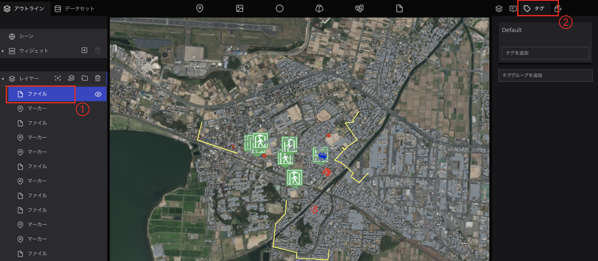
  
  
#### 3.3.2 地域防災支援プラグインの表示項目の設定
  
  （1）地域防災支援プラグインの表示項目を設定します。  
    ①画面左側アウトラインの部分の「ウィジェット」から「地域防災支援プラグイン」をクリックすると画面右側に地域防災支援プラグインの設定項目が表示されます。  
    ②「防災関連施設」、「多くの人が集まる施設」、「災害時に役に立つもの」、「災害時に障害になる設備等」のそれぞれの項目の「＋ボタン」をクリックすることで、各項目にメニューを追加することができます。  

  （それぞれの項目名はお好みの文字に変更することができます。変更方法は「[3.6プラグインのカスタマイズ](#36-プラグインのカスタマイズ)」を参照してください。）

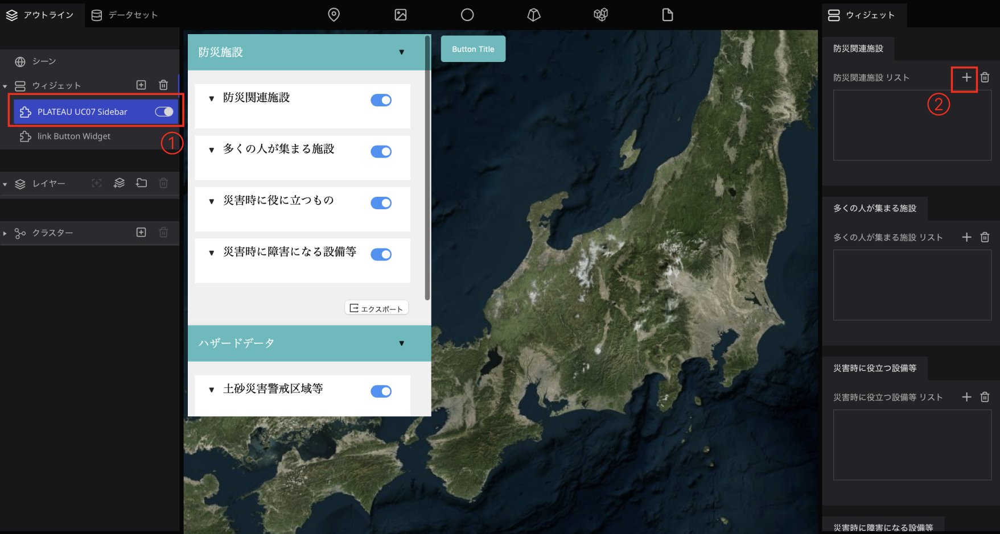　

  （2）追加する項目リストの「+ボタン」をクリックし、追加されたメニューに対して以下の内容を設定します。  
  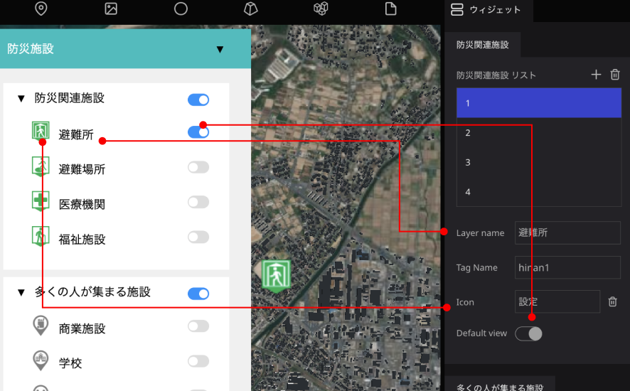
   
   * Layer Name：地域防災支援プラグイン上での表示名を入力します。
   * Tag Name：「タグの設定」で入力したタグ名と同じ文字を入力します。タグを設定することで、地域防災支援プラグイン上のボタンをクリックした際にそのタグが設定されているレイヤーの表示/非表示を切り替えることができるようになります。
   * Icon：アイコン画像を指定します。「未設定」の部分をクリックすると画像を選択することができます。使用する画像をアップロードし、選択してください。
   * Default view：最初に画面を表示した際、レイヤを表示する場合は、オンにします。（デフォルトではオフの状態で非表示になります。）

  ランドマークフラグに設定されたタグ名と「Tag Name」に設定したタグ名が一致していると、プラグインの各項目をオン/オフすることで、表示/非表示を切り替えることができます。

* （参考）本ユースケースでは以下のメニューを設定しました。
     * 「防災関連施設」には避難所、避難場所、医療機関、福祉施設
     * 「多くの人が集まる施設」には商業施設、学校、コミュニティ施設、オフィス
     * 「災害時に役に立つもの」には避難経路のサイン、街頭消化器、AED、その他ポジティブ要素
     * 「災害時に障害になる設備等」には放置自転車、路上駐車、避難経路のバリア、ブロック塀、ブロック塀（ライン）、自動販売機、電柱、崖・急傾斜地、その他ネガティブ要素  

### 3.4 リンクボタンプラグインの設定

リンクボタンプラグインを設定することで、画面上にボタンを設置することができます。そのボタンによく利用するURLを設定しておけば、あらかじめ設定したURLのサイトへ簡単にアクセスすることができるようになります。

①ウィジェットに追加された「link Button Widget」をクリックすると、画面右側に設定項目が表示されます。  
②画面右側に表示される以下の内容を設定します。  
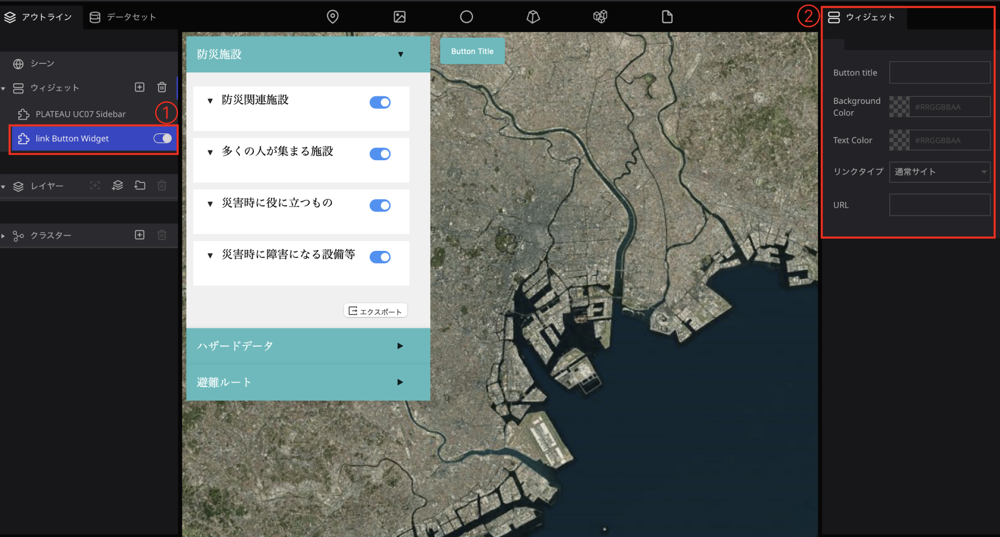
 
   * Button Title：ボタンに表示されるタイトルを入力します。
   * BackGround Color：ボタンの背景色を指定します。
   * Text Color ：ボタンのテキスト色を指定します。
   * リンクタイプ：ボタンをクリックした際に移動する先のサイトを通常サイトか、地理院地図かgeojson.ioから選択します。
     * 通常サイトの場合は、URL欄に入力したサイトへのリンクボタンになります。
     * 地理院地図を選択した場合は、Re:Earthで表示中の地図範囲の地理院地図ページへのリンクボタンになります。
     * geojson.ioを選択した場合は、Re:Earthで表示中の地図範囲のgeojson.ioページへのリンクボタンになります。
      （地理院地図やgeojson.ioへのリンクは、ラインデータを描画する際に活用します。）
   * URL：ボタンクリック時に移動するサイトのURLを入力します（リンクタイプが通常サイトの時のみ有効）

### 3.5 プラグインの使い方

#### 3.5.1 地域防災支援プラグイン
 
- レイヤの表示/非表示
1. 閲覧する項目のボタンをクリックすると、ボタンが青色になります。閲覧する項目にサイドバーが青になるようチェックを入れます。
2. 地図上に選択した項目がアイコンと共に可視化されます。
3. アイコンをクリックすることで、その地点の詳細情報が表示されます。
4. 各項目をオン/オフすることで、表示/非表示を切り替えることができます。

- メニューの折りたたみ

▼の部分をクリックすることで、メニューを折りたたみ表示することができます。
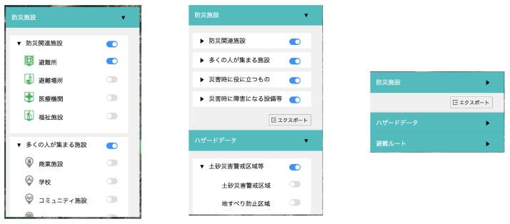

- 地点情報のエクスポート  
1.防災施設の項目の最下部「エクスポート」ボタンをクリックします。  
2.マップに表示中の防災施設マーカーのインフォボックスの内容をエクセル形式のファイルがダウンロードすることができます。  
3.保存される内容は、インフォボックスに設定されている項目が対象となります。インフォボックスに設定されていない情報は出力されません。  
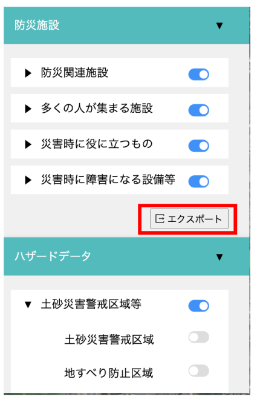

#### 3.5.2 リンクボタンプラグイン
  

1.「Button Title」(任意のタイトル)のボタンをクリックすることで、あらかじめ指定されたURLのサイトへアクセスできます。  
2.リンクタイプを「地理院地図」もしくは「geojson.io」にしている場合、リンク先のサイトでは、Re:Earth上で表示されている画面と同じ場所の地図が表示されます。
  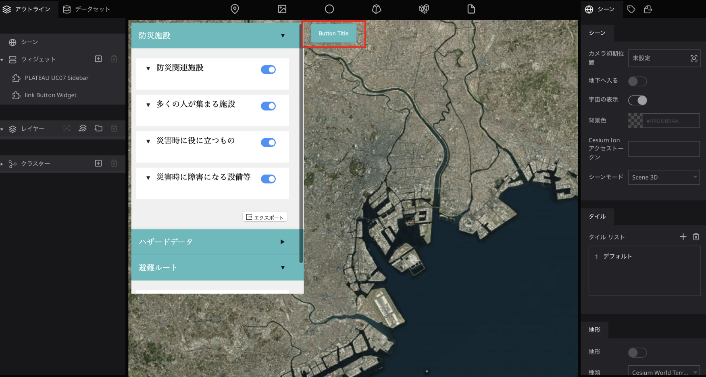
  

### 3.6 プラグインのカスタマイズ
地域防災支援プラグインのメニュー項目名(下画像の赤枠部分)を任意の文字列に変更する場合は、プラグインファイルを編集します。

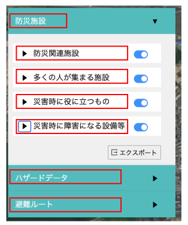

1. プラグインファイルの編集
   
「disaster_prevention_support_plugin.zip」を展開し、その中にある「disastersupport.js」をテキストエディタで開きます。

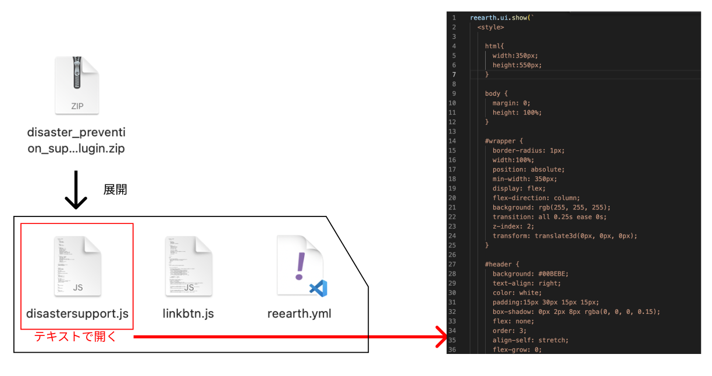

コード内の以下の行の「span」タグ内の文字を任意の文字に編集することで可能です。

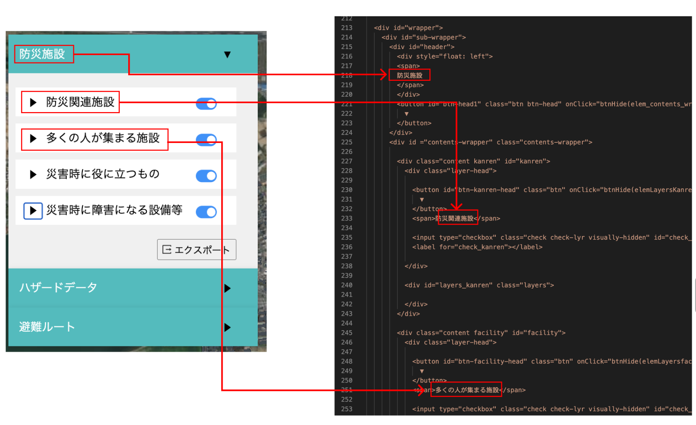​

下図内の変更箇所番号の内容は、次の表に示すコード行番号を編集することで変更可能です。
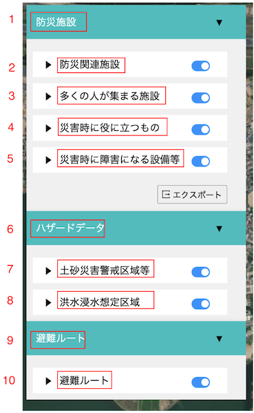​

| 変更箇所番号 | コード行番号 |
| ------------ | ------------ |
| 1            | 218行目      |
| 2            | 233行目      |
| 3            | 251行目      |
| 4            | 269行目      |
| 5            | 287行目      |
| 6            | 318行目      |
| 7            | 333行目      |
| 8            | 351行目      |
| 9            | 375行目      |
| 10           | 390行目      |

2. 定義ファイルの編集
   
プラグイン設定時にRe:Earth右画面に表示される設定項目名を変更していきます。
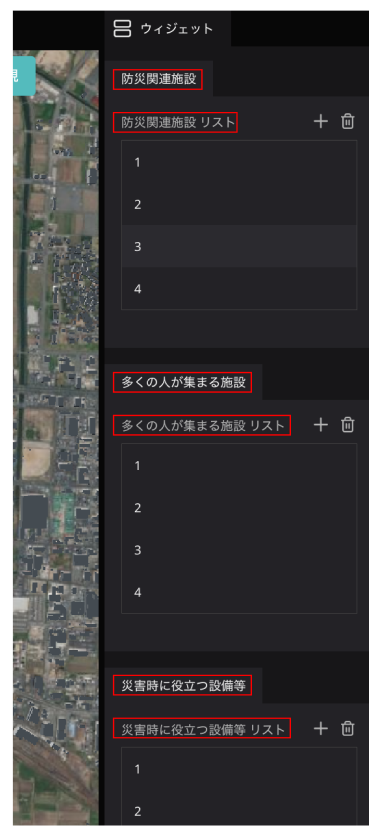​

「reearth.yml」をテキストエディタで開きます。

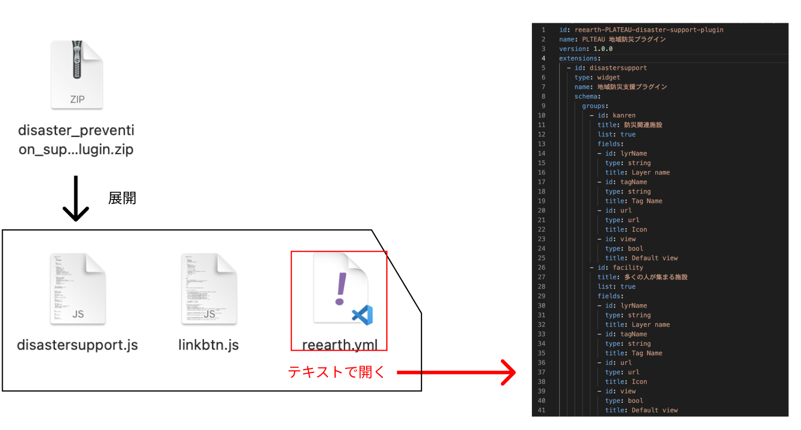​

それぞれの項目名の変更は、次の表のコード行番号の「title」の文字を任意の文字に編集します。

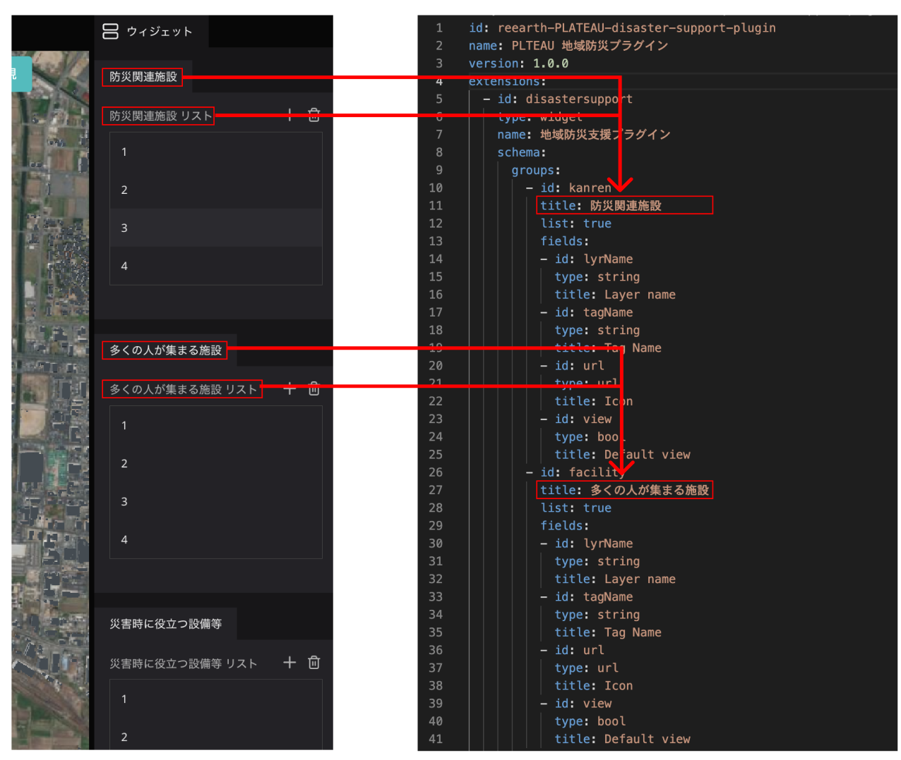​

| 変更項目                 | コード行番号 |
| ------------------------ | ------------ |
| 防災関連施設             | 27行目       |
| 多くの人が集まる施設     | 43行目       |
| 災害時に障害になる設備等 | 59行目       |
| 土砂災害警戒区域等       | 75行目       |
| 洪水浸水想定区域         | 91行目       |
| 避難ルート               | 107行目      |

3. プラグインファイルの再インストール

各ファイルを編集したら、「disastersupport.js」、「linkbtn.js」、「reearth.yml」の３ファイルをzipファイルに圧縮します。
圧縮したzipファイルをRプラグインとしてRe:Earthのプロジェクトにインストールします。

（プラグインのインストールは[3.1.2 プラグインのインストール](#312-プラグインのインストール)を参照ください。）
各項目名が編集した内容で表示されます。

​

## 4 ライセンス<!-- omit in toc -->
* ソースコードおよび関連ドキュメントの著作権は国土交通省に帰属します。
* 本ドキュメントは[Project PLATEAUのサイトポリシー](https://www.mlit.go.jp/plateau/site-policy/)（CCBY4.0および政府標準利用規約2.0）に従い提供されています。
​
## 5 注意事項<!-- omit in toc -->
* 本レポジトリは参考資料として提供しているものです。動作保証は行っておりません。
* 予告なく変更・削除する可能性があります。
* 本レポジトリの利用により生じた損失及び損害等について、国土交通省はいかなる責任も負わないものとします。
​
## 6 参考資料<!-- omit in toc -->
* （近日公開）地域防災支援プラグイン技術検証レポート: https://www.mlit.go.jp/plateau/libraries/technical-reports/
* PLATEAU Webサイト Use caseページ「地域防災支援プラグイン」: https://www.mlit.go.jp/plateau/use-case/
* Re:Earth：https://reearth.io/
* PLATEAU配信サービス（試験運用）-チュートリアル：https://github.com/Project-PLATEAU/plateau-streaming-tutorial
